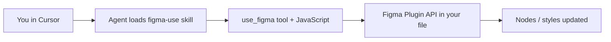

# Cursor Figma Plugin — ක්‍රියා කරන හැටි (Vidya Chinthana)

මෙය **දෙකක්** එකට: **Code Connect** (design ↔ code link) සහ **Figma MCP** (`use_figma` — Figma file එකේ JS run කර edit කරනවා).

---

## 1. Code Connect (ඔයාගේ React components ↔ Figma)

**අරමුණ:** Figma component එකක් click කළාම dev ට **සැබෑ code snippet** පෙනෙනවා.

### Setup

1. `figma.config.json` — `src/components/ui/`, `profile/` map කර තියෙනවා
2. Template files: `ArticleCard.figma.ts`, `ProfileSocialBar.figma.ts`
3. Figma file key + `node-id` — template එකේ `// url=` comment එක update කරන්න
4. Figma Desktop → component → **Code Connect** → template link කරන්න

### Cursor එකෙන්

- Figma plugin enable කරන්න (Cursor Settings → MCP)
- Agent ට කියන්න: *"Get Code Connect suggestions for ArticleCard"*
- MCP: `get_code_connect_suggestions` (plugin skill අනුව)

**Vidya site run කිරීමට** Code Connect අවශ්‍ය නැහැ — design team / dev handoff සඳහා.

---

## 2. Figma MCP `use_figma` (Figma file එක direct edit)

**අරමුණ:** Chat එකෙන් Figma canvas එකේ frames, components, variables හදනවා / වෙනස් කරනවා.

### Flow

1. Figma file open (browser or desktop) + Cursor Figma MCP connected
2. Agent **figma-use** skill කියවනවා (නැත්නම් errors)
3. `use_figma` — කුඩා JS scripts (create frame, set colors, auto-layout…)
4. Return value = JSON (node IDs, etc.)

### Rules (කෙටියෙන්)

- Colors **0–1** range (not 0–255)
- Text edit: **load font → await → mutate**
- Pages: `await figma.setCurrentPageAsync(page)` only
- Errors වුණාම script atomic — fix script, retry
- Full screens: **figma-generate-design** skill එකත් load කරන්න

### Vidya Chinthana සඳහා practical use

| Task | Tool |
|------|------|
| Marketing hero Figma mockup | `use_figma` + generate-design |
| Design tokens → site theme | Variables export → Studio theme panel |
| Component library in Figma | generate-library skill |
| Live site edit | **Vidya Studio** (not Figma) |

**Studio = site එකට publish.** Figma = design lab. දෙකම එකට: Figma එකේ design → export images → Studio **Assets** upload.

---

## 3. Quick commands (Cursor chat)

- `Create a hero frame in Figma matching Vidya sci-fi theme`
- `Link ArticleCard to Code Connect`
- `List variables in my Figma file`

---

## 4. Files in this repo

| File | Purpose |
|------|---------|
| `docs/FIGMA.md` | Code Connect config |
| `docs/STUDIO_VS_FIGMA.md` | Studio vs Figma parity |
| `figma.config.json` | Code Connect paths |
| `*.figma.ts` | Component templates (excluded from tsc) |
